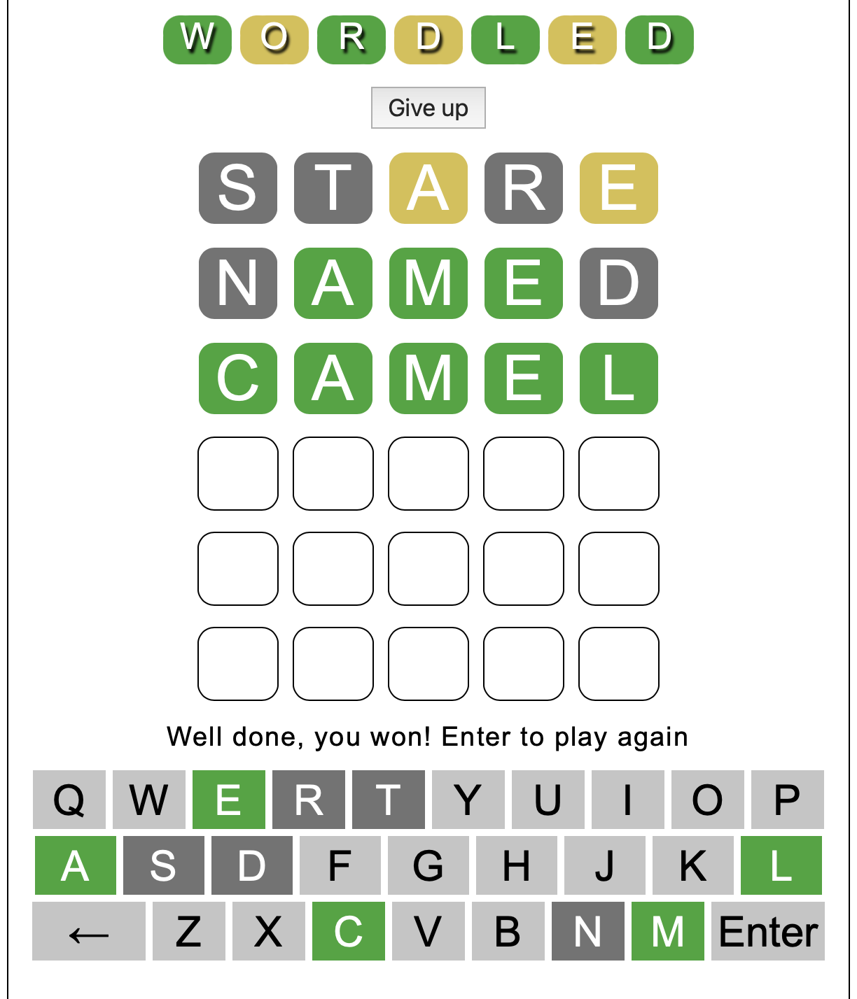

# wordled

A word game similar to [Wordle](https://www.powerlanguage.co.uk/wordle/), but
with different word lists. It chooses a new random word each time, so you can
play as often as you like, not just once per day. There is no social media
posting or score keeping, just fun and Wordle skill building.

I started with code from @ozboware, who since added a lot of features. You can
play his version online at [wordled.online](https://wordled.online).

There are five word lists of increasing difficulty in the file
[assets/js/answers.js](assets/js/answers.js). The default is level2 which
contains over 1000 common words. The simplest, level1, is a list of 100 words
suitable for young children with a limited vocabulary. Level5 contains over
13,000 words and is extremely difficult. You can even add your own list by
following the "add a difficulty level" instructions in
[assets/js/game.js](assets/js/game.js)

**No installation required**

Wordled can be played in your browser. Simply open the [index.html](index.html)
file in any browser to play.

