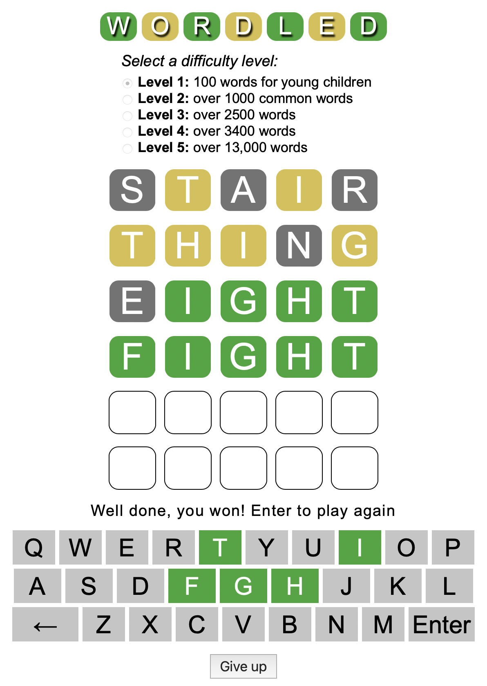

# wordled

A word game similar to [Wordle](https://www.nytimes.com/games/wordle/), but with
five different word lists. It chooses a new random word each time, so you can
play as often as you like, not just once per day. There is no social media
posting or score keeping, just fun and Wordle skill building.

The word lists are in the file [assets/js/answers.js](assets/js/answers.js). The
default contains over 1000 common words. The simplest contains 100 words
suitable for young children with a limited vocabulary. The most difficult
contains over 13,000 words. You can even add your own list by following the "add
a difficulty level" instructions in [assets/js/game.js](assets/js/game.js)

You can play it online at
[https://monty.github.io/wordled/](https://monty.github.io/wordled/)

You can play it on your computer even with no internet connection. Simply open
the [index.html](index.html) file in any browser to play.

### Background

I started with code from @ozboware, who since added a lot of features I chose to
leave out. You can play his version online at
[wordled.online](https://wordled.online).

### Game board

